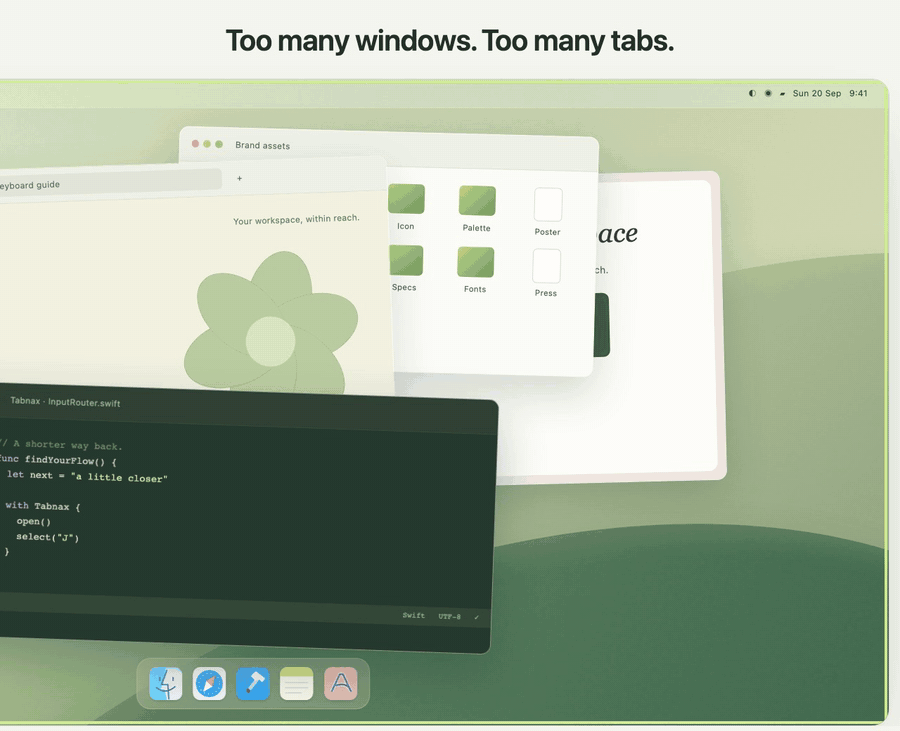
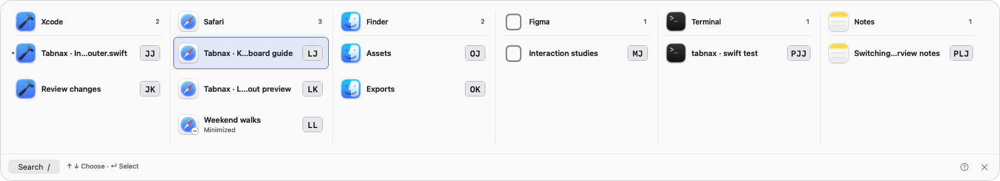
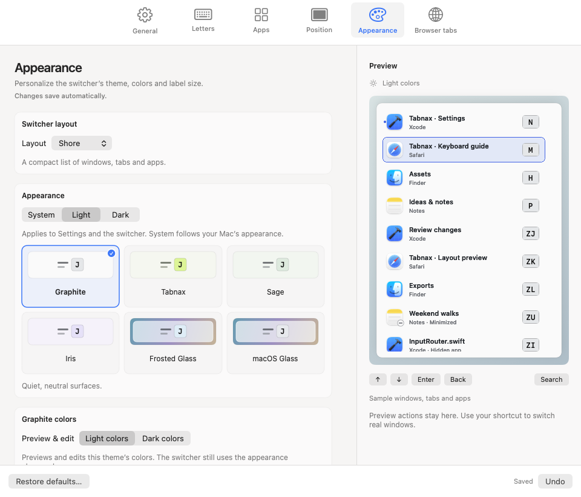

<p align="center"></p>

# Tabnax

**A little shortcut. A lot more flow.**

Tabnax is a native macOS switcher that brings windows, browser tabs, and apps into one keyboard-driven view. Give destinations stable letters, type an address, and get back to your work.

**macOS 15+ · Apple silicon · Swift 6 · AppKit + SwiftUI · Apache-2.0 · In active development**

[Install](#install) · [Product overview](docs/PRODUCT.md) · [Build the app](macos/README.md) · [Website](website/README.md) · [Documentation](docs/README.md) · [Security](SECURITY.md)

[](website/assets/tabnax-demo.mp4)

▶ **[Watch the full walkthrough](website/assets/tabnax-demo.mp4)** (1 min): switching, search, launching, restoring minimized windows, the six layouts and themes. The walkthrough is recorded from the website's interactive demo and ends with the native app.



## What you can do

- **Go straight to a destination.** Stable, prefix-free addresses select on the final keypress. Choose ergonomic letter sets, initials, or pairs; use search when you need it.
- **Bring windows, tabs, and apps together.** Search titles and browser context, activate apps, restore minimized windows, and request normal app quitting.
- **Keep your app shortcuts.** Assign persistent app letters and optionally launch assigned apps when they are closed.
- **Choose one of six layouts.** Switch between compact lists, window plaques, app columns, a spatial grid, app families, and a current/previous-window view.
- **Make it fit your Mac.** Configure the activation shortcut, press/hold behavior, optional mouse selection, display, and per-layout placement.
- **Make it yours.** Six themes, System/Light/Dark appearance, larger labels, stronger outlines, and native glass with accessibility fallbacks.
- **See changes before applying them.** Six settings panes share the actual native preview renderer, with explicit letter drafts, scoped resets, and Undo.
- **Stay in control.** Optional launch at login, explicit macOS permissions, local browser connections, and no analytics or cloud account in the current source.

| Layout | How it works |
| --- | --- |
| **[Shore](website/assets/native/mode-shore.png)** | A compact list with a direct address for each destination. |
| **[Beacons](website/assets/native/mode-beacons.png)** | Letters beside visible windows, with a fallback bank for other targets. |
| **[Canopy](website/assets/native/mode-canopy.png)** | App columns containing their windows and tabs. |
| **[Lattice](website/assets/native/mode-lattice.png)** | An address grid with stable slots and explicit overflow. |
| **[Fold](website/assets/native/mode-fold.png)** | Choose an app prefix, then a child window or tab. |
| **[Relay](website/assets/native/mode-relay.png)** | Return to the previous observed window, with other destinations on a shelf. |



The images show app-owned native views with sample data. The website provides a separate interactive simulation of all six layouts.

## Install

**Requirements:** a Mac with Apple silicon running macOS 15 Sequoia or later.

### Option 1: Homebrew (recommended)

```sh
brew install --cask danmartuszewski/tap/tabnax
```

Homebrew handles the first-launch approval described below, so you can go straight to [First launch](#first-launch).

### Option 2: Download the DMG

1. Download **[Tabnax.dmg](https://github.com/danmartuszewski/tabnax/releases/latest/download/Tabnax.dmg)** from the [latest release](https://github.com/danmartuszewski/tabnax/releases/latest).
2. Open it and drag **Tabnax** to **Applications**.
3. Open Tabnax from Applications. macOS says it can't verify the app: click **Done**.
4. Open **System Settings → Privacy & Security**, scroll to the Security section, click **Open Anyway** next to the Tabnax message, and confirm with your password or Touch ID.

Instead of steps 3–4 you can run `xattr -dr com.apple.quarantine /Applications/Tabnax.app` once.

Why the extra step: releases are signed with the project's own certificate but are **not notarized by Apple**, which needs a paid developer account. You approve Tabnax once; updates keep working and keep the Accessibility permission. Each release lists a `.sha256` checksum, and `codesign -dvv /Applications/Tabnax.app` shows `Authority=Tabnax Release Signing`.

### First launch

1. Tabnax lives in the menu bar and opens its Settings on first launch. Click **Allow access…** and turn Tabnax on in **System Settings → Privacy & Security → Accessibility**. It needs this to list and focus windows.
2. Press **Control–Option–Space** to open the switcher, then type a letter. Change the shortcut, layout and theme in **Settings**.
3. Browser tabs: Arc, Chrome, Edge and Brave work after you allow the macOS **Automation** prompt for each browser. Firefox, Zen and Safari need a companion extension; see [Browser connections](#browser-connections).

Tabnax checks for updates with Sparkle and asks before checking automatically. Homebrew users can also run `brew upgrade --cask tabnax`.

### Uninstall

Quit Tabnax from the menu bar and move it to the Trash, or run `brew uninstall --cask tabnax` (add `--zap` to remove its settings too).

## Try it locally

From the repository root, preview the product website with Python 3:

```sh
make website
```

Open [localhost:4173](http://127.0.0.1:4173). Only the self-contained `website/` directory is served. It needs no npm install or build step; `website/index.html` also opens directly in a browser.

To build and run the native app, use an Apple silicon Mac with macOS 15+, Xcode with the macOS 26 SDK or newer, and its command-line tools selected:

```sh
make build
open macos/build/DerivedData/Build/Products/Debug/Tabnax.app --args --settings
# Or rebuild and reopen automatically as native source changes:
make dev
```

Enable Accessibility for the build you run in **Settings → General**, then press **Control–Option–Space**. The shared project uses ad-hoc signing; no private certificate is required. See the [native guide](macos/README.md) for local signing overrides and browser setup.

## Browser connections

| Browsers | Adapter | Approval/setup |
| --- | --- | --- |
| Arc, Chrome, Edge, Brave | Built-in Apple Events | Per-browser macOS Automation consent. |
| Firefox, Zen | Companion extension + native messaging | Temporary development installation; permanent distribution needs a signed add-on. |
| Safari | Embedded Safari web extension | Safari extension approval; current releases are not Apple-signed and require unsigned-extension mode. |

The Safari companion needs an Apple-signed app, so for now it works only with Safari's **Allow unsigned extensions** developer setting, which resets when Safari quits.

Private tabs are excluded. Connections expose tab metadata for switching; they do not inject content scripts or read page contents. The [privacy overview](docs/PRIVACY.md) describes the data and permissions involved.

## Repository map

```text
tabnax/
├── macos/                 Native app, Xcode project, core package, companions, tests
├── website/               Self-contained product website, demo, curated images
├── docs/                  Product, architecture, privacy, development, publication
├── design-exploration/    Historical layout prototypes and design rationale
├── settings-exploration/  Historical settings prototype and behavior contracts
├── scripts/               Portable checks and publication tooling
└── .github/               CI, dependency updates, issue and PR templates
```

Each area has its own README. Native paths remain stable for Xcode and existing development workflows. Build output, raw verification captures, local agent files, credentials, and signing material are ignored. [Structure and ownership](docs/REPOSITORY.md) explains where new files belong.

## Development checks

```sh
make check         # Public-file policy, docs/site links, JS and Python checks
make test-core     # Pure Swift models (macOS / Swift 6)
make test-native   # Core + native XCTest contracts (Xcode)
make test-ui       # Includes interactive XCUITest scenarios
make audit        # Candidate-file and full Git-history Gitleaks scan
```

`make audit` requires a [verified Gitleaks installation](scripts/README.md). CI checks portable code, native build/tests, and secret exposure. Releases are cut by merging the Release Please PR; [releasing](docs/RELEASING.md) covers the pipeline, versioning, and distribution. `make dmg` packages an ad-hoc DMG for local testing.

## Project status

The native implementation and product demo are present. Versions stay on 0.x while compatibility is validated. The Firefox/Zen companion is not yet published as a signed add-on. Compatibility across Spaces, full-screen apps, Stage Manager, input utilities, and hardware arrangements needs broader validation. Intel builds, a Windows/Linux native app, and cloud sync are outside the current implementation.

See the [feature matrix](docs/PRODUCT.md), and [native verification record](macos/VERIFICATION.md). Historical prototypes describe earlier design stages; the current app and product docs take precedence.

## Contributing and license

Read [CONTRIBUTING.md](CONTRIBUTING.md) before making changes, and [SECURITY.md](SECURITY.md) before reporting a vulnerability.

Tabnax is licensed under the [Apache License 2.0](LICENSE). You may use, modify, and redistribute it, including commercially, provided you keep the copyright and [NOTICE](NOTICE) attribution that points back to this project and mark files you changed.
