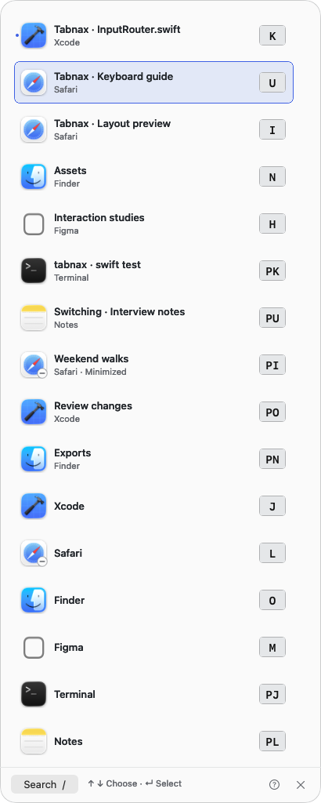

# Tabnax — product presentation

**Your windows, tabs, and apps. One quiet place.**

Working across a busy Mac means remembering where something is: which app, which window, which browser tab. Tabnax brings those destinations together and gives them stable keyboard addresses. Open the switcher, type the letters you see, and continue where you intended.

## The product in one sentence

A native macOS window and browser-tab switcher with stable letters, persistent app shortcuts, and six ways to see your workspace.

It is built for people who move repeatedly between editors, browsers, documents, and communication tools. Keyboard addresses support direct selection; search and optional mouse controls support discovery when a destination is unfamiliar.

## Feature inventory

| Area | Implemented behavior |
| --- | --- |
| Activation | Command–Tab default; one-click Control–Option–Space alternative that keeps the macOS app switcher; recorded custom chords; modifier-side selection; press-to-open and hold-to-show; optional quiet quick return to the previous window in hold mode. |
| Addresses | Stable labels, initials-first or pairs, hand presets, custom alphabet/order, physical or typed-character interpretation, overflow, explicit reset. |
| Navigation | Direct final-key selection, prefix/back, arrows/Tab, Enter, Escape, slash search with native text/IME handling. |
| Windows | Exact AX identities, normal/minimized targets, restore on selection, Option restore, minimized badges. |
| Apps | Running app targets, persistent app letters, optional launch of closed assigned apps, normal Command-Q quit request. |
| Tabs | Approved Arc/Chrome/Edge/Brave adapters, Firefox/Zen/Safari companions, browser inclusion/ranges, private-tab exclusion. |
| Layouts | Shore, Beacons, Canopy, Lattice, Fold, Relay. All support windows, tabs, assigned app launching, and explicit search. |
| Mouse | Off, click selection, or click + wheel highlighting; wheel movement never commits. |
| Placement | Shared display choice, per-layout nine-point anchor/inset, bounded placement frozen when opening. |
| Appearance | Graphite, Tabnax, Sage, Iris, Frosted Glass, macOS Glass; light/dark/system; per-theme colors; readable keys; larger labels and stronger outlines. |
| Settings | General, Letters, Apps, Position, Appearance, Browser tabs; native preview; shared letter drafts; Apply/Discard; scoped restores; Undo. |
| Startup | Menu bar presence and opt-in launch at login with observed system status. |
| Data handling | Local preferences/processing; explicit permissions; no implemented analytics/cloud account; no screen capture requirement. |

Detailed interactions and caveats live in the [native guide](../macos/README.md).

## Six ways to switch

| Mode | Presentation | Best suited to |
| --- | --- | --- |
| Shore | A narrow, direct-address list. | A compact view that is easy to scan. |
| Beacons | Window-adjacent plaques plus a fallback bank. | The spatial desktop you already recognize. |
| Canopy | Columns organized by app. | Related windows and tabs together. |
| Lattice | Address tiles grouped by app in a grid. | Browsing an app’s windows and tabs together. |
| Fold | App prefix followed by a child letter. | App families with a compact initial view. |
| Relay | Current/previous window pair and direct shelf. | Repeatedly returning between two windows. |

## Suggested demonstration

1. Start the [website](../website/README.md) with `make website` and open the playground.
2. Select Shore and type a visible address. Explain that the browser demo simulates selection.
3. Switch to Fold or Canopy to show app/child addresses; try slash search for a title or browser context.
4. Show fixed app letters and a simulated closed-app launch. Restore a minimized sample window.
5. Try Relay, then another theme and dark appearance.
6. Open a native layout image and the settings gallery. These are actual own-view exports; the interactive playground is HTML.
7. Open the build guide. Explain development setup and browser approval requirements.

## Availability and boundaries

The build targets Apple silicon and macOS 15+. Native Liquid Glass is used on macOS 26+, with a frosted fallback on earlier systems and solid accessibility fallbacks. Source builds are available locally; signed/notarized public downloads and browser-store releases are not yet available.

Broader verification remains for Spaces/full-screen, Stage Manager, input utilities, physical layouts, and multi-display hardware. Component benchmarks do not establish universal end-to-end latency or battery-life claims. Intel, Windows/Linux native apps, and cloud sync are not implemented. Signed releases update through Sparkle.

The website does not discover real windows, launch/quit apps, grant permissions, persist native settings, or reproduce OS global key capture. Its image exports use opaque colors for glass because offscreen rendering does not capture the live desktop compositor.
